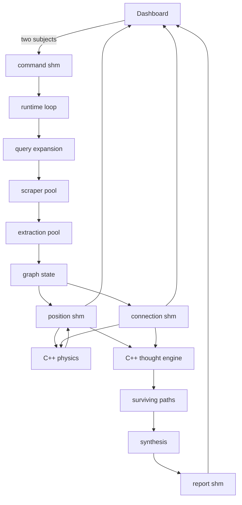

# ContextGraph

Give it two subjects. It searches the web for both, pulls the claims out of what it finds, builds a graph where the nodes are concepts and the edges are source-backed relationships, runs a physics simulation until that graph settles into a shape, walks paths through it looking for routes from one subject to the other, and writes a cited report about how they connect.

Everything runs locally except the web search. The graph lives in shared memory so Python, two C++ binaries, and the browser dashboard can all read it without serializing anything in the hot path.

## Why a graph and not a summary

Asking a model about two subjects gets you two summaries stapled together. The interesting part is the path between them, and a path is a thing a graph has and prose does not.

So the pipeline never asks for an answer. It asks for relationships, one clause at a time, each tied to the sentence and the URL it came from. The answer is whatever route survives to the end, and every hop in it can be traced back to a source.

## How it runs

A single status byte in shared memory tells every process what the system is doing.

| Phase | Who drives it | What happens |
| --- | --- | --- |
| Idle | Dashboard | Waiting for a pair of subjects. |
| Research | Python workers | Queries get expanded, pages get scraped, clauses become graph edges. |
| Physics | C++ | Nodes and edges settle into a 3D layout. |
| Stable | Python | The graph is pruned to what could actually support a route. |
| Thinking | C++ | Agents walk paths from one subject toward the other. |
| Synthesis | Python | The surviving paths become a cited report. |



## Layout

```
main.py                  process tree, phase transitions, shared-memory lifecycle
build.sh                 environment setup and native compilation
frontend/                FastAPI server and the Three.js dashboard
src/engine/
  runtime.py             command loop, query scheduling, ingestion, synthesis trigger
  common/                constants, capacities, phase ids, shared-memory helpers
  extract/               query expansion, scraping, clause extraction, the word map
  agents/                graph nodes and packed connection records
  graph/                 graph state, connection packing, post-physics pruning
  thought/               path routing, and the two C++ engines
  synthesis/             report generation from surviving paths
```

The C++ sources sit next to the Python that drives them rather than in a separate tree, because `thought/` is one idea implemented in two languages and splitting it by language would hide that.

## Shared memory

Five segments. Python writes most of them, C++ writes positions back, and the dashboard reads.

| Segment | Written by | Holds |
| --- | --- | --- |
| `pos` | graph, physics | Position and velocity per node, 6 floats each |
| `connections` | graph | Packed edges, 40 bytes each |
| `status` | runtime, native engines | The current phase |
| `command` | dashboard | The subject pair |
| `report` | runtime, synthesis | Live status text and the final report |

Capacity is 64,000 nodes and 80,000 edges, set in `src/engine/common/constants.py`. The native engines only ever see the packed records; the richer evidence a citation needs stays on the Python side.

## Extraction

Source text becomes edges in a few steps, and most of the work is throwing things away.

1. `noise_cleanup.py` drops boilerplate and anything too vague to cite.
2. `logic.py` runs a spaCy dependency parse and pulls subject / relation / predicate out of each clause, keeping the sentence it came from.
3. `word_info_map.py` embeds node labels and merges ones that mean the same thing, using a cosine band between 0.84 and 0.97. Below that they are different concepts; above it they are the same string with different whitespace.
4. `graph.py` packs what survives into the connection segment.

The merge band is the part worth tuning. Set it too wide and every proper noun collapses into one node.

## Running it

Needs macOS, Python 3.11, Homebrew, `g++`, a [Serper](https://serper.dev) key for search, and [Ollama](https://ollama.com) for local synthesis.

```bash
echo "SERPER_API_KEY=your-key" > .env
./build.sh
```

That installs raylib, builds the environment, pulls the spaCy model and `llama3.2:3b`, compiles both engines into `venv/`, and opens the dashboard on `http://localhost:8000`.

| Variable | Default | Purpose |
| --- | --- | --- |
| `SERPER_API_KEY` | none | Web search. Required. |
| `CONTEXTGRAPH_RUNTIME_ROOT` | repo root | Where `logs/`, `sql/`, and `results/` land |
| `CONTEXTGRAPH_ENV_PATH` | `.env` | Alternate credentials file |
| `CONTEXTGRAPH_PHYSICS_ENGINE` | `venv/physics-engine` | Override the compiled binary |
| `CONTEXTGRAPH_THOUGHT_ENGINE` | `venv/thought-engine` | Override the compiled binary |

## Dashboard

`frontend/ui.py` serves the app and streams graph state over a websocket at 30 Hz.

| Route | Purpose |
| --- | --- |
| `POST /command` | Submit a subject pair |
| `GET /results` | Saved reports |
| `GET /results/{id}` | One saved report |
| `WS /ws` | Live nodes, phase, and report text |

`main.js` caps what it draws at 2,400 nodes and 3,600 edges. The backend holds far more than the browser can usefully render, so the cap is a display limit and not a graph limit.
