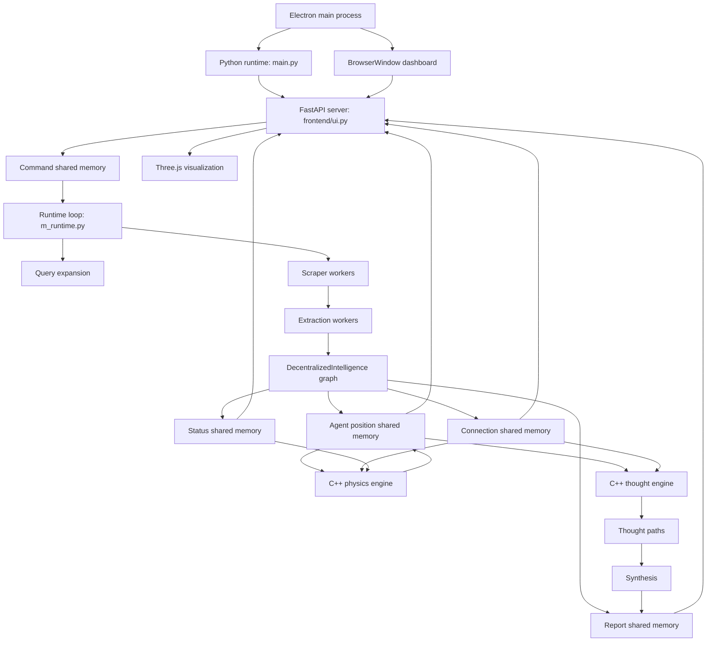

# Decentralized Intelligence

Decentralized Intelligence is a local research system that builds a source-grounded relationship graph between two targets, runs a native physics simulation over that graph, then sends graph-walking thought agents through the stabilized structure to produce a cited synthesis.

The packaged desktop app lives in the GitHub Releases tab. This README focuses on the system architecture behind that app: process boundaries, shared memory, graph construction, physics, routing, and synthesis.

## System Shape

```text
User prompt
  |
  v
Electron shell
  |
  v
Python orchestrator
  |
  |-- FastAPI dashboard server
  |-- scraper worker pool
  |-- extraction worker pool
  |-- graph state manager
  |-- C++ physics engine
  |-- C++ thought engine
  |-- local synthesis/report writer
  |
  v
Three.js graph dashboard + report sidebar
```

The system takes two targets, such as `Urban Sprawl` and `Housing Affordability`, and treats the research task as a graph-building problem. Search results become source text, source text becomes normalized relationship records, relationship records become graph edges, and the graph becomes the substrate for physics and thought traversal.

## Architecture Diagram



## Runtime Phases

The runtime is phase-driven. A single status byte in shared memory tells the orchestrator, dashboard, and native engines what the system is doing.

| Phase | Constant | Owner | What Happens |
| --- | --- | --- | --- |
| Idle | `PHASE_IDLE` | Dashboard/runtime | The dashboard can accept a new two-target command. |
| Research | `PHASE_RESEARCH` | Python workers | Query expansion, scraping, extraction, and graph ingestion run. |
| Physics | `PHASE_PHYSICS` | C++ physics engine | Nodes and connections are simulated into a 3D layout. |
| Stable | `PHASE_STABLE` | Python orchestrator | The graph is pruned to route-relevant nodes and edges. |
| Thinking | `PHASE_THINKING` | C++ thought engine | Thought agents traverse source-backed paths through the graph. |
| Synthesis | `PHASE_SYNTHESIS` | Python synthesizer | Successful paths are converted into the final report. |

## Process Model

### Electron Shell

`electron/main.cjs` is the desktop wrapper. It handles first-run setup, API-key storage, runtime bootstrapping, backend launch, and window lifecycle. In development it runs the repo directly; in packaged builds it uses Electron's private user-data runtime folder.

### Python Orchestrator

`main.py` owns the process tree. It creates shared-memory segments, starts the FastAPI dashboard, starts scraper and extractor worker pools, launches the runtime engine thread, starts the native physics process when research quiets down, and starts thought routing after physics completes.

### Runtime Engine

`m_runtime.py` is the command and ingestion loop. It watches command shared memory for new target pairs, generates query plans, queues scrape jobs, ingests extracted relationships, triggers refinement passes, and starts synthesis when thought processing is done.

### Graph State Manager

`p_graph.py` defines the `DecentralizedIntelligence` object. It owns in-memory agent records, merge buckets, connection metadata, target routing state, thought state, and the shared-memory handles used by the dashboard and native engines.

### Native Engines

The project uses C++ where tight loops matter:

- `p_physics.cpp` maps agent positions, connections, and status from shared memory, then runs the graph force simulation until energy stabilizes or the time limit is reached.
- `p_thought.cpp` reads the stabilized graph and assigned seed/goal routes, samples graph paths, and writes compact thought-path results for Python to load.

## Shared Memory Interface

The core runtime uses shared memory so Python, C++, and the dashboard server can exchange graph state without JSON serialization in the hot path.

| Segment | Producer | Consumers | Purpose |
| --- | --- | --- | --- |
| `pos` | Python graph, C++ physics | Dashboard, C++ physics, C++ thought | Agent position and velocity records. |
| `connections` | Python graph | Dashboard, C++ physics, C++ thought | Packed graph edge records. |
| `status` | Python orchestrator, native engines | Dashboard, runtime, native engines | Current runtime phase. |
| `command` | FastAPI dashboard | Runtime loop | Target A / Target B command payload. |
| `report` | Python runtime/synthesis | Dashboard | Live status text and final synthesis output. |

The main graph capacities are configured in `u_constants.py`:

- `MAX_AGENTS = 64000`
- `MAX_CONNECTIONS = 80000`
- Agent position record: 6 floats, stored as `x, y, z, vx, vy, vz`.
- Connection record: packed 40-byte record with endpoint indexes, relation id, utility, and endpoint state fields.

## Data Pipeline

1. The dashboard writes a command payload into shared memory.
2. The runtime parses `Target A` and `Target B`.
3. Query expansion creates target-specific and bridge queries.
4. Scraper workers fetch and clean source pages.
5. Extraction workers convert source text into relationship records.
6. The graph manager normalizes agent names, merges similar agents, and packs connections into shared memory.
7. The orchestrator waits for queues to quiet, optionally runs a refinement scrape pass, then enters physics.
8. The physics engine updates node positions until the graph cools or times out.
9. The active subgraph pass keeps route-supporting connections and nearby source-specific context.
10. The thought engine walks from selected seed agents toward target-matched goal agents.
11. Successful paths are loaded back into Python.
12. The synthesis layer writes a cited relationship report.

## Graph Construction

The graph is built from extracted source-backed relationship records. Each record is cleaned into a subject, relation, predicate, source, evidence text, and optional specificity fields.

Important graph responsibilities:

- `p_connection_graph.py` packs and indexes connection records.
- `p_active_subgraph.py` prunes the stabilized graph to route-supporting nodes and edges.
- `o_info_agent.py` represents graph agents.
- `o_connection.py` wraps packed connection records and endpoint state.
- `d_noise_cleanup.py` filters unusable or overly vague extracted text.
- `d_word_info_map.py` handles embedding and similarity lookup for agent merging.

The graph keeps both compact shared-memory data and richer Python-side metadata. Native engines only need the compact records; reporting and synthesis use the richer evidence fields.

## Physics Simulation

The physics engine treats the research graph as a dynamic 3D structure. Agents have positions and velocities, and connections act like weighted constraints. The simulation gives initialized nodes a small starting push, applies connection forces, dampens motion, keeps nodes inside soft bounds, and exits when average kinetic energy stabilizes.

This phase is not just decoration. The resolved spatial layout is used by the interface and by later graph routing heuristics. The dashboard streams the changing positions over WebSocket and renders the result with Three.js.

## Thought Routing

After physics, the runtime selects target-matched seed and goal agents. The active subgraph pass keeps directed routes between those anchors plus useful adjacent context.

The thought engine then samples paths through this graph. It favors reachable, unvisited, spatially reasonable next steps and records why each thought stopped: endpoint reached, dead end, or maximum hops. Python reloads those paths and attaches the source-backed evidence needed for synthesis.

## Synthesis

Synthesis is local. Successful thought paths are ranked for target fit, source diversity, specificity, and route quality. `s_synthesis.py` converts the strongest paths into a report that emphasizes the relationship between the two targets rather than a generic summary of either target alone.

The report is written into shared memory for the live dashboard and into `results/` for history.

## Frontend And Dashboard

The dashboard has two jobs:

- Provide the command surface for entering target pairs.
- Render live shared-memory state as a graph, status display, history sidebar, and report view.

`frontend/ui.py` serves the app and exposes:

- `POST /command` for target-pair commands.
- `GET /results` for saved synthesis history.
- `GET /results/{id}` for a saved result.
- `WS /ws` for live graph, phase, and report updates.

`frontend/main.js` renders the graph with Three.js. It caps visible nodes and bonds for dashboard performance while the backend can hold much larger graph state.

## Visual Slots

Use this section for architecture-supporting media: physics GIFs, graph screenshots, and short clips of the phase transitions.

### Physics Simulation

| Graph Forming | Graph Settling |
| --- | --- |
|  |  |

### Dashboard Screenshots

| Research Input | Stabilized Graph | Synthesized Report |
| --- | --- | --- |
|  |  |  |

Suggested media paths:

- `docs/media/physics-simulation-forming.gif`
- `docs/media/physics-simulation-settling.gif`
- `docs/media/dashboard-input.png`
- `docs/media/dashboard-stable-graph.png`
- `docs/media/dashboard-report.png`

## Key Files

| Path | Role |
| --- | --- |
| `electron/main.cjs` | Desktop wrapper, runtime setup, API-key prompt, backend process management. |
| `main.py` | Top-level process orchestration and phase transitions. |
| `m_runtime.py` | Runtime command loop, query scheduling, ingestion, synthesis trigger. |
| `p_graph.py` | Central graph state object and shared-memory graph ownership. |
| `p_connection_graph.py` | Connection packing, indexing, and attachment. |
| `p_active_subgraph.py` | Post-physics route-supporting graph pruning. |
| `p_physics.cpp` | Native graph physics engine. |
| `p_thought.cpp` | Native thought-route sampling engine. |
| `p_thought_process.py` | Python thought route selection and result loading. |
| `frontend/ui.py` | FastAPI dashboard server and WebSocket streamer. |
| `frontend/main.js` | Three.js graph visualization and dashboard behavior. |
| `s_synthesis.py` | Local report generation from successful thought paths. |
| `u_constants.py` | Runtime constants, capacities, phase ids, and paths. |

## Development Notes

The packaged app is the recommended way to try the system. Source runs are mainly for development.

Development requirements:

- Node.js and npm
- Python 3.11
- Homebrew
- `g++`
- raylib
- Serper API key
- Local Ollama server for synthesis

Run from source:

```bash
npm install
npm start
```

Manually bootstrap the Python environment and native engines:

```bash
npm run setup
```

Build distributable artifacts:

```bash
npm run make
```

Runtime output is written to:

- `logs/` for startup and process logs.
- `sql/` for local caches.
- `results/` for synthesis output.
- `venv/` for the local Python environment and compiled native engines.
